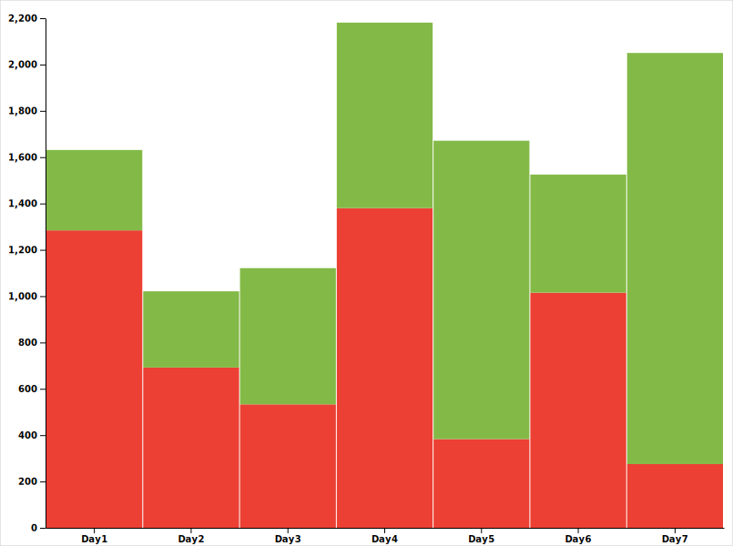

# GRP Tour du Beaufortain 2023-09

# Photo albums

[All pictures](photos)

# Topo

In this section, I will describe our "version" of the GRP. If you want a more "official" one, you can try one of this:

| Source | km | D+ | Topo |
| ------ | -- | -- | ---- |
| [MonGR.fr](https://www.mongr.fr/trouver-prochaine-randonnee/itineraire/gr-de-pays-tour-du-beaufortain) | 98.8 | 5 718 | [GPX](gpx/mongr.gpx) |
| IGN map | 97.7 | 5 643 | [Topo](https://brouter.de/brouter-web/#map=12/45.7106/6.5846/1069&lonlats=6.458923,45.720413;6.452786,45.721452;6.451077,45.729223;6.499572,45.753122;6.51,45.766581;6.528862,45.783627;6.542916,45.773719;6.547723,45.762583;6.589072,45.771684;6.642459,45.794818;6.704108,45.776389;6.71799,45.746609;6.717322,45.722332;6.726768,45.69928;6.718225,45.695839;6.678999,45.659881;6.641579,45.648668;6.608457,45.617868;6.567721,45.647408;6.562539,45.652795;6.536264,45.645698;6.539376,45.655051;6.53355,45.657027;6.522724,45.656199;6.495845,45.659574;6.470711,45.684957;6.453127,45.702628;6.461468,45.717286;6.460235,45.719237;6.45936,45.720376&profile=hiking-mountain) |
| TopoGuides FFRandonnée | 99 | 5 736 | [Topo](https://brouter.de/brouter-web/#map=12/45.7126/6.6059/1069&lonlats=6.458923,45.720413;6.452786,45.721452;6.451077,45.729223;6.499572,45.753122;6.510172,45.76435;6.50721,45.766445;6.507082,45.772283;6.527885,45.782766;6.532231,45.784795;6.542916,45.773719;6.547723,45.762583;6.589072,45.771684;6.642459,45.794818;6.693056,45.781861;6.704108,45.776389;6.707416,45.755323;6.707953,45.754885;6.71799,45.746609;6.717195,45.724099;6.726768,45.69928;6.718225,45.695839;6.678999,45.659881;6.642201,45.649096;6.607847,45.617369;6.607118,45.618931;6.567721,45.647408;6.562539,45.652795;6.536264,45.645698;6.539376,45.655051;6.53355,45.657027;6.522724,45.656199;6.495845,45.659574;6.470711,45.684957;6.453127,45.702628;6.457794,45.718166;6.458416,45.719274;6.459076,45.720035;6.45936,45.720376&straight=15&profile=hiking-mountain)
| Our version | 99.7 | 5 564 | [Topo](https://brouter.de/brouter-web/#map=12/45.7113/6.5863/standard&lonlats=6.458923,45.720413;6.452786,45.721452;6.451077,45.729223;6.499572,45.753122;6.507275,45.76718;6.52799,45.782817;6.530567,45.787899;6.542916,45.773719;6.547723,45.762583;6.58941,45.771426;6.642459,45.794818;6.689601,45.763751;6.713526,45.750592;6.71799,45.746609;6.717322,45.722332;6.705565,45.71133;6.698699,45.70979;6.696639,45.700258;6.696084,45.674213;6.664785,45.64874;6.656663,45.645114;6.651235,45.638918;6.63939,45.637172;6.608457,45.617868;6.581841,45.651308;6.567721,45.647408;6.562539,45.652795;6.536264,45.645698;6.538539,45.654848;6.53355,45.657027;6.522724,45.656199;6.495845,45.659574;6.470711,45.684957;6.453127,45.702628;6.45789,45.718168;6.459655,45.719301;6.45936,45.720376&profile=hiking-mountain) |

Topo of our trek:

<iframe width="100%" height="564px" frameborder="0" allowfullscreen allow="geolocation" src="//umap.openstreetmap.fr/en/map/treck-beaufortain_945878?scaleControl=false&miniMap=false&scrollWheelZoom=false&zoomControl=true&allowEdit=false&moreControl=true&searchControl=null&tilelayersControl=null&embedControl=null&datalayersControl=true&onLoadPanel=undefined&captionBar=false&captionMenus=true&datalayers=2929913%2C2941317#11/45.7266/6.5836"></iframe>
<a href="//umap.openstreetmap.fr/en/map/treck-beaufortain_945878">See full screen</a>

Our trek lasted for seven days and 6 nights, we camped at different spots along the way. You can see our route and our bivouac locations ⛺️ on the map above. We started and ended our trek in Queige 🏳️, where we left our car. We followed the trail clockwise, exploring the natural beauty and diversity of the Beaufortain.

| Track | km | D+ | D- | Topo |
| ----- | -- | -- | -- | ---- |
| Full trek clockwise 🔃 | 99.7 | 5 564 | 5 564 | [Full](https://brouter.de/brouter-web/#map=12/45.7113/6.5863/standard&lonlats=6.458923,45.720413;6.452786,45.721452;6.451077,45.729223;6.499572,45.753122;6.507275,45.76718;6.52799,45.782817;6.530567,45.787899;6.542916,45.773719;6.547723,45.762583;6.58941,45.771426;6.642459,45.794818;6.689601,45.763751;6.713526,45.750592;6.71799,45.746609;6.717322,45.722332;6.705565,45.71133;6.698699,45.70979;6.696639,45.700258;6.696084,45.674213;6.664785,45.64874;6.656663,45.645114;6.651235,45.638918;6.63939,45.637172;6.608457,45.617868;6.581841,45.651308;6.567721,45.647408;6.562539,45.652795;6.536264,45.645698;6.538539,45.654848;6.53355,45.657027;6.522724,45.656199;6.495845,45.659574;6.470711,45.684957;6.453127,45.702628;6.45789,45.718168;6.459655,45.719301;6.45936,45.720376&profile=hiking-mountain) |
| Day 1: Queige ➡️ Refuge du Lachat | 15.4 | 1 284 | 347 |[Day1](https://brouter.de/brouter-web/#map=13/45.7577/6.4807/OpenTopoMap&lonlats=6.458923,45.720413;6.452789,45.721499;6.451077,45.729223;6.499572,45.753122;6.507275,45.76718;6.52799,45.782817;6.530567,45.787899&profile=hiking-mountain) |
| Day 2: Refuge du Lachat ➡️ Croix de Pierre | 13.7 | 692 | 329 | [Day2](https://brouter.de/brouter-web/#map=14/45.7785/6.5716/OpenTopoMap&lonlats=6.530567,45.787899;6.542916,45.773719;6.547723,45.762583;6.58941,45.771426;6.623297,45.794459&profile=hiking-mountain)
| Day 3: Croix de Pierre ➡️ Plan Jovet | 12.4 | 533 | 588 | [Day3](https://brouter.de/brouter-web/#map=14/45.7737/6.6712/OpenTopoMap&lonlats=6.62323,45.794489;6.642496,45.794848;6.689601,45.763751;6.713526,45.750592&profile=hiking-mountain) |
| Day 4: Plan Jovet ➡️ Refuge de Presset | 18.1 | 1 380 | 801 | [Day4](https://brouter.de/brouter-web/#map=12/45.7075/6.7037/OpenTopoMap&lonlats=6.713526,45.750592;6.71799,45.746609;6.717322,45.722332;6.705565,45.71133;6.698699,45.70979;6.696639,45.700258;6.696084,45.674213;6.664785,45.64874&profile=hiking-mountain) |
| Day 5: Refuge de Presset ➡️ Lac de Saint-Guérin | 13.5 | 383 | 1 288 | [Day5](https://brouter.de/brouter-web/#map=14/45.6361/6.6209/OpenTopoMap&lonlats=6.664785,45.64874;6.656663,45.645114;6.651235,45.638918;6.63939,45.637172;6.608457,45.617868;6.581841,45.651308&profile=hiking-mountain) |
| Day 6: Lac de Saint-Guérin ➡️ Lacs de Lavouet | 14 | 1 015 | 510 | [Day6](https://brouter.de/brouter-web/#map=14/45.6521/6.5424/OpenTopoMap&lonlats=6.581841,45.651308;6.567721,45.647408;6.562539,45.652795;6.536264,45.645698;6.538539,45.654848;6.53355,45.657027;6.522724,45.656199;6.497254,45.657938&profile=hiking-mountain) |
| Day 7: Lacs de Lavouet ➡️ Queige | 12.5 | 275 | 1 775 | [Day7](https://brouter.de/brouter-web/#map=13/45.6926/6.4759/standard&lonlats=6.497265,45.658245;6.470711,45.684957;6.453127,45.702628;6.457866,45.718162;6.459653,45.719314;6.45936,45.720376&profile=hiking-mountain) |

Comparison of elevation gain, D+ 🟥 and D- 🟩 per day:

If you are planning to start your trek from Queige, I suggest that you go clockwise. This way, you will have a more gradual ascent on the first day, reaching the Refuge du Lachat with an elevation gain of about 1300 meters. This is a good option considering that you are carrying a heavy backpack with food and other supplies. If you go counter-clockwise, you will face a steeper climb of about 1700 meters on the first day, which can be very challenging and exhausting.

# Story

- [Day 1](day1.md)